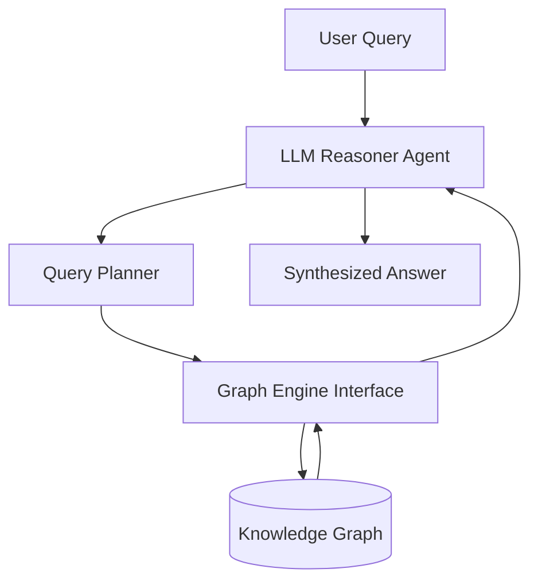

# 🕸️ GraphRAG Agentic Framework

[](https://www.python.org/downloads/)
[](https://opensource.org/licenses/MIT)

**GraphRAG Agentic Framework** is an advanced, open-source library that bridges the gap between **Large Language Models (LLMs)** and **Knowledge Graphs (KGs)**. 

Inspired by complex challenges in **Biomedical Research (Drug Discovery)** and **Public Sector Data Extraction**, this framework enables autonomous agents to perform multi-hop reasoning, validate facts against structured graphs, and generate highly accurate, hallucination-free outputs.

## 🚀 Key Features

- **Agentic Traversal:** Autonomous LLM agents that can dynamically query, traverse, and reason over complex knowledge graphs.
- **Plug-and-Play Graph Engine:** Easily integrate with Neo4j, NetworkX, or custom biomedical graphs (e.g., AstraZeneca's BIKG).
- **Multi-Hop Reasoning:** Capable of finding hidden relationships (e.g., linking a gene target to a phenotype through intermediate pathways).
- **Extensible Prompting:** Built-in system prompts optimized for scientific research and complex data synthesis.

## 🏗️ Architecture



## 🛠️ Installation

```bash
git clone https://github.com/gavedwards0/GraphRAG-Agentic-Framework.git
cd GraphRAG-Agentic-Framework
pip install -r requirements.txt
```

## 🔬 Example Usage

Check out the `examples/` directory for full implementations:

- `drug_discovery_example.py`: Simulates navigating a biomedical knowledge graph to find synergistic drug combinations.

```python
from src.agent import GraphRAGAgent
from src.graph_engine import MockBiomedicalGraph

# Initialize the mock graph and agent
engine = MockBiomedicalGraph()
agent = GraphRAGAgent(llm_model="gpt-4", graph_engine=engine)

# Query the agent
response = agent.run_query("What are the potential pathways linking Drug_A to Phenotype_Z?")
print(response)
```

## 🤝 Contributing
Contributions are welcome! Please open an issue or submit a Pull Request.

## 👤 Author
**Gavin Edwards**  
Principal AI Engineer @i.AI | Ex-AstraZeneca
